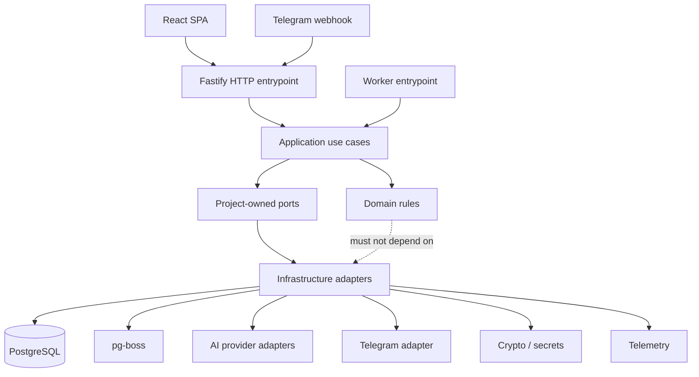
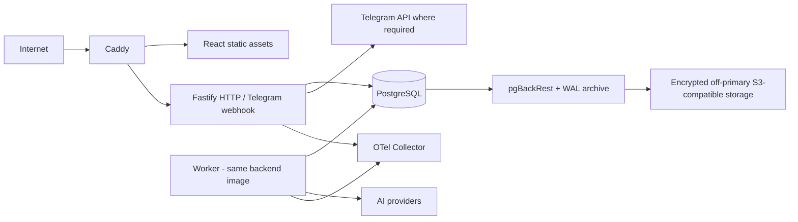

# Architecture Spine — Mahalla Ovozi

## Design Paradigm

Mahalla Ovozi is a **hexagonal modular monolith**: one cohesive application/codebase and MVP deployment boundary, organized into domain-oriented modules. Domain and application logic depend only on project-owned contracts. Web/Telegram transports, persistence, durable jobs, AI providers, and other infrastructure integrate through adapters at meaningful external or stateful boundaries.

HTTP/webhook handling and asynchronous workers may run as separate runtime processes from the same codebase when operationally useful; they are not independently designed microservices.



## Product-Bound Constraints

These approved product semantics constrain architecture and are not implementation choices:

- Topic identity is District + Mahalla + Uzbekistan calendar day + same underlying situation; Topic/reply/topic matching never crosses midnight.
- Topic matching uses a direct Telegram reply first. Otherwise, only the nearest earlier same-day Topic-linked message may be considered, and only when meaning fits; the system must not guess.
- One canonical Topic may belong to multiple Lanes; Lane membership must not create duplicate Topic identities.
- Within a District, one Telegram group maps to exactly one Mahalla.
- Telegram-marked forwarded messages are excluded before AI analysis and Accepted Evidence retention.
- Application roles are limited to Product Owner and Hokim. There is no public registration; passwords require at least 12 characters and account/session revocation must take effect deterministically.
- Context-dependent AI processing uses the complete required raw Accepted Evidence from all same-day Topics in the same Mahalla, plus the supported candidate message when applicable.
- RAG, vector retrieval, summaries, recent-message windows, cross-day memory, or silent truncation must not replace required same-day evidence context.
- Raw Accepted Evidence follows the approved 90-day retention boundary and deletion lifecycle.
- Existing completed message-level relevance/Topic-assignment decisions are not automatically rerun when configuration changes or Topic-derived fields are recalculated.
- AI failures, refusals, invalid structured output, context overflow, timeouts, rate limits, and provider failures remain explicit failures; no partial or invented success may be committed.
- District authorization, lifecycle, retention, subscription rules, and other deterministic policy boundaries are never delegated to AI.

## Invariants & Rules

### AD-1 — Hexagonal modular monolith [ADOPTED]

- **Binds:** all application modules, transports, persistence, jobs, AI integrations, Telegram integrations, and deployment entrypoints.
- **Prevents:** premature microservices, provider SDKs becoming domain contracts, infrastructure concerns leaking into domain rules, and incompatible dependency directions across agent-built modules.
- **Rule:** Build one modular monolith with domain-oriented modules. Domain/application code may depend on project-owned ports but not on infrastructure adapters or provider SDKs. Adapters implement those ports. Separate HTTP/webhook and worker processes may run from the same codebase, but no MVP subsystem becomes an independently versioned network service without a later architecture decision.

### AD-2 — TypeScript/Node application stack [ADOPTED]

- **Binds:** browser application, HTTP/API, Telegram webhook handling, asynchronous workers, shared contracts, package management, and runtime/tooling choices.
- **Prevents:** parallel backend ecosystems, SSR/server-action coupling without a requirement, incompatible TypeScript toolchains, and duplicated application logic between HTTP and worker runtimes.
- **Rule:** Use a pnpm TypeScript workspace targeting Node.js 24 LTS. Fastify 5.x serves the private JSON API and Telegram webhook transport. HTTP/webhook and worker entrypoints share the same backend modules. The private browser application is a React 19.2 SPA built with Vite 8.x and minimal React Router. Start on TypeScript 6.0.x. Do not introduce Next.js, SSR, React Server Components, or server actions without a later concrete requirement.

### AD-3 — PostgreSQL system of record and PostgreSQL-backed durable jobs [ADOPTED]

- **Binds:** authoritative application state, Telegram intake durability, asynchronous processing, retries, ordering-sensitive work, and idempotency.
- **Prevents:** split-brain persistence, database-to-broker dual-write gaps, Redis/broker operational complexity, duplicate business effects from retryable work, and success acknowledgement before durable intake.
- **Rule:** PostgreSQL 18.x is the sole MVP application system of record and pg-boss 12.x is the durable job mechanism. Persist authoritative state and enqueue consequential asynchronous work atomically whenever correctness requires both. A Telegram update is acknowledged as successful only after the authorized update and its required asynchronous work are durable. Duplicate Telegram deliveries and retryable jobs must resolve to one logical intake/business effect through application-level idempotency. Ordering-sensitive work may use stable District+Mahalla+Uzbekistan-day queue keys while independent scopes run concurrently; queue ordering is coordination, never the final correctness boundary.

### AD-4 — Drizzle schema ownership and reviewable SQL migrations [ADOPTED]

- **Binds:** relational schema definition, typed database access, transactions, PostgreSQL-specific operations, and schema evolution.
- **Prevents:** opaque ORM behavior, schema/type drift, production schema mutation through ad-hoc push workflows, and unnecessary handwritten mapping layers.
- **Rule:** Use stable Drizzle ORM 0.45.x with PostgreSQL/node-postgres and Drizzle Kit 0.31.x. TypeScript schema definitions are the codebase schema source of truth. Schema changes generate version-controlled SQL migrations that are reviewed before application; shared and production databases must not use direct schema-push workflows. Prefer typed SQL-like Drizzle APIs and explicit transactions; use parameterized native PostgreSQL SQL where PostgreSQL behavior is clearer or not adequately represented by Drizzle.

### AD-5 — Deterministic complete same-day AI context snapshots [ADOPTED]

- **Binds:** every context-dependent AI operation, evidence serialization, ordering, overflow handling, reproducibility, and context traceability.
- **Prevents:** semantic retrieval replacing required evidence, silent context loss, nondeterministic prompt assembly, duplicate canonical context stores, and unverifiable AI inputs.
- **Rule:** Build each contextual AI input as a canonical snapshot scoped by District+Mahalla+Uzbekistan day, containing the candidate when applicable plus all required raw Accepted Evidence from every same-day Topic in that Mahalla. Read the snapshot in a short consistent PostgreSQL read and release the transaction before any provider call. Preserve raw evidence text/captions verbatim; compact only repetitive structural metadata. Order evidence by original Telegram timestamp, then Telegram message ID, then internal evidence ID. Record a monotonically increasing Mahalla/day `contextRevision`, deterministic snapshot fingerprint, and serializer version. If the complete required context cannot fit the supported AI request, fail explicitly with no AI-derived commit; never truncate, summarize, retrieve top-K, or cross days to compensate.

### AD-6 — Optimistic AI concurrency and stale-snapshot rejection [ADOPTED]

- **Binds:** contextual AI commit safety, concurrency, revision mutation, stale work, and retry behavior.
- **Prevents:** old AI results overwriting newer evidence/Topic state, long database locks across provider calls, and queue ordering being mistaken for concurrency correctness.
- **Rule:** Contextual AI work captures the expected Mahalla/day `contextRevision`, performs the provider call outside database transactions, and conditionally commits only if the relevant scope still has that revision and the operation subject remains valid. A mismatch is `STALE_SNAPSHOT` and commits no AI-derived state. Mutations that change canonical AI-input state increment the revision atomically. Derived-projection-only writes do not advance `contextRevision` unless the changed field is explicitly part of canonical AI input. Queue serialization may reduce races but never replaces the revision/CAS check. Retry only unfinished stale candidate/message work against the newest complete context; never replay previously completed historical message-level decisions merely because context advanced.

### AD-7 — Targeted Topic-derived generations and coalesced refresh [ADOPTED]

- **Binds:** Topic summary/Lane/anchor/attribution/latest-activity derived projections, refresh scheduling, coalescing, and stale derived work.
- **Prevents:** recalculating every same-day Topic after unrelated evidence, recomputing obsolete intermediate states, partial derived-field updates, and replay of old message-level decisions.
- **Rule:** Treat Topic-derived information as one atomic recalculable projection. Only Topics whose own Accepted Evidence or other derived-field source state changes become refresh targets, although each refresh evaluates against the complete required same-day Mahalla context. Each Topic tracks monotonic `requiredDerivedGeneration` and `appliedDerivedGeneration`. Source changes advance the required generation and ensure logical refresh work exists; pending generations may coalesce to the newest required generation without dropping evidence or imposing an arbitrary debounce. A refresh captures both target generation and Mahalla/day context revision and commits the complete validated projection only if both remain valid. Stale work commits nothing and converges to the newest required state.

### AD-8 — Project-owned provider-neutral AI gateway and immutable profiles [ADOPTED]

- **Binds:** all production AI calls, provider adapters, prompt/schema configuration, validation, retries, traceability, and AI failure handling.
- **Prevents:** provider SDK types leaking into domain/application contracts, historical configuration mutating in place, schema-conformant hallucinations committing, provider-specific failure semantics spreading across modules, and partial AI success.
- **Rule:** All production AI operations pass through a Mahalla Ovozi-owned typed AI gateway. Provider SDKs, native responses, and native errors remain inside adapters. Operation outputs use project-owned Zod 4 schemas converted only to a deliberately portable JSON-Schema subset for provider structured-output features. Every provider result must pass application structural validation and operation-specific semantic validation before commit. AI profiles are immutable/versioned and capture operation, provider adapter, exact model identifier, prompt/schema versions, generation parameters, limits, retry policy, and capability configuration; activation is prospective and never replays historical completed message-level decisions. Logical AI operations and provider attempts have separate identifiers. A logical operation pins its immutable AI profile version when created; retries of that logical operation use the same profile, while newer source generations created after profile activation use the then-active profile rather than mutating the older operation. Normalize provider outcomes into explicit application failure categories and commit no partial result. Prompt caching is optional adapter behavior only and may never alter canonical context semantics.

### AD-9 — Database-backed sessions, explicit District scope, and encrypted District secrets [ADOPTED]

- **Binds:** authentication, authorization, tenant isolation, sessions, District-owned data, Telegram bot credentials, lifecycle/offboarding, and browser credential handling.
- **Prevents:** identity-framework requirements contaminating the product model, long-lived unrevocable bearer authorization, IDOR/cross-District access, cross-District foreign-key mistakes, plaintext stored bot tokens, and secret leakage.
- **Rule:** Use project-owned username/password authentication backed by PostgreSQL. Hash passwords with Argon2id using stable `argon2` 0.45.x. Sessions are opaque, revocable, database-backed records; persist only a hash of the browser session token and deliver the usable token only through a host-scoped Secure, HttpOnly, SameSite=Strict cookie over HTTPS. Rate-limit login attempts and enforce trusted same-origin/Origin/Fetch-Metadata checks for protected state-changing browser requests. Authentication produces a server-derived `ActorContext`: Hokim is bound to exactly one District; Product Owner may act globally but must name an explicit target District for District-scoped operations. Client District state is never authorization evidence. All District-owned records carry `district_id`; repository contracts require explicit District scope and database relationships preserve District identity. Background jobs carry explicit District scope and re-check relevant lifecycle/access state before external or AI side effects; Product Owner cross-District/global operations use dedicated explicit global administrative contracts, never an omitted District scope. PostgreSQL RLS is deferred for MVP. Deployment secrets remain outside the database/repository. District Telegram bot tokens are stored only as authenticated ciphertext under a deployment-held versioned key, and plaintext credentials never enter logs, audit payloads, telemetry, URLs, or browser persistence. Rotation/offboarding removes obsolete active credentials according to lifecycle rules.

### AD-10 — Same-origin REST contracts and scoped frontend server state [ADOPTED]

- **Binds:** browser/API integration, request/response validation, client server-state management, Product Owner District switching, pagination, mutations, and browser-visible error handling.
- **Prevents:** incompatible API styles, database/provider/job objects leaking to the browser, cross-District cache collisions, stale prior-District responses rendering, unsafe optimistic lifecycle success, and ad-hoc error shapes.
- **Rule:** Use a same-origin versioned JSON REST API under `/api/v1/*` served by Fastify. Request/response contracts are project-owned Zod schemas shared through a dedicated API-contract package; database rows, provider SDK types, and job representations never cross the API boundary. Use TanStack Query 5.x for remote server state and ordinary React state for ephemeral interaction/form state; do not add Redux, Zustand, GraphQL, tRPC, or a BFF without a later concrete requirement. District-scoped query identities always include District scope. After the approved dirty-state guard resolves, a Product Owner District change cancels prior-District work, removes prior-District protected query data, clears District-bound local content state, then activates and loads the new District; cancellation alone is insufficient, and late responses whose District differs from the active District must never render. Authentication/authorization/lifecycle loss purges affected protected cached data. Long collections use opaque server-issued cursor/keyset pagination with deterministic ordering and explicit load-more interaction. Sensitive/authoritative mutations use no optimistic authoritative success and retry automatically only when the operation contract explicitly makes retry safe. API failures use a stable sanitized error envelope.

### AD-11 — Single-host Compose deployment, continuous PostgreSQL recovery, and privacy-safe observability [ADOPTED]

- **Binds:** production topology, public ingress, process deployment, backups, WAL archiving, restore readiness, disaster recovery, deletion reconciliation, metrics/traces/logs, and System Health separation.
- **Prevents:** unnecessary orchestration complexity, publicly exposed internal services, same-host-only backups, untested recovery assumptions, deleted District resurrection after restore, observability becoming a second resident-content store, and product health depending on a telemetry vendor.
- **Rule:** Deploy the MVP on one Linux host using Docker Compose. Caddy 2.11.x is the only public edge, terminates HTTPS, serves the built SPA, and reverse-proxies API/Telegram webhook traffic to Fastify. HTTP and worker runtimes use the same backend image/codebase; PostgreSQL and internal service ports are private. Use pgBackRest 2.58.x with continuous PostgreSQL WAL archiving to an encrypted off-primary S3-compatible object-store repository. Configuration and scheduled isolated restore drills must demonstrate RPO ≤1 hour and RTO ≤8 hours; normal application/ingestion access remains disabled after a disaster restore until lifecycle/deletion reconciliation proves permanently deleted Districts cannot reappear operationally. Maintain a minimal current deletion-tombstone reconciliation source outside restorable PostgreSQL backup history; it contains only privacy-safe lifecycle identifiers/metadata, never resident evidence or secrets. Use OpenTelemetry for stable backend traces/metrics through an OTLP/collector boundary and structured privacy-safe JSON application logs; raw resident evidence, AI context, search text, credentials, and secrets must not enter routine telemetry. Capture intake, queue age/backlog, retries, stale snapshots, context evidence/bytes/tokens, AI/end-to-end latency, cost, failure/overflow, Topic refresh/coalescing, database/WAL/backup, and restore-drill measurements. Evaluate grouping quality using explicit labeled/pilot evaluation data, not invented operational metrics. Product Owner System Health is application-owned sanitized state and must remain available independently of the engineering telemetry backend.

## Consistency Conventions

| Concern | Convention |
| --- | --- |
| TypeScript/code style | Strict TypeScript; prefer pure functions and functional composition. Classes are limited to external-system adapter/connectors where they materially help. |
| Names | TypeScript values/files use established camelCase/kebab-case conventions and exported types/components use PascalCase; PostgreSQL schema uses `snake_case`; stable machine error codes use `SCREAMING_SNAKE_CASE`. |
| IDs and time | Use opaque stable IDs. Store instants as PostgreSQL `timestamptz`/UTC; preserve original Telegram timestamps; derive the product calendar day and product-facing time explicitly in `Asia/Tashkent`. |
| Tenant scope | Every District-owned application/repository operation carries explicit District scope; missing scope is an error, never “all Districts.” |
| Transactions | Keep database transactions short; never hold a DB transaction/lock across Telegram or AI network calls. Couple authoritative writes and required jobs transactionally when correctness requires both. |
| Jobs/idempotency | Jobs are retryable. Logical business effects require explicit idempotency/uniqueness keys; infrastructure delivery claims never replace application idempotency. |
| API | Same-origin `/api/v1/*` JSON REST; project-owned Zod request/response contracts; sanitized stable error envelope. |
| Frontend state | TanStack Query owns server state; React owns ephemeral UI/form state. District scope is part of every District query key and protected cache lifecycle. |
| UI styling | Implement the approved UX with semantic CSS custom properties and locally scoped CSS/CSS Modules; do not introduce an external component/styling framework in the MVP baseline without a later concrete need. |
| AI context | Raw evidence is verbatim, complete for required same-day scope, deterministically ordered, fingerprinted/versioned, and never silently truncated or summarized. |
| Secrets/logging | Redact/exclude credentials, raw resident evidence, AI context, and ephemeral search text from routine logs, metrics, traces, raw errors, URLs, and browser persistence. |
| Audit | Record privacy-safe operational/admin metadata such as actor, District/scope, action, timestamp, outcome, and safe identifiers; never store raw resident evidence or credentials in audit payloads. |
| Tests | Use Vitest 4.1.x for backend/frontend test execution and Playwright 1.60.x for critical browser journeys; favor integration/E2E behavior over low-value implementation-detail tests. |
| Workspace | Use pnpm 11.x workspaces and commit the lockfile; package boundaries must follow the architecture modules rather than become a generic shared-code dumping ground. |

## Stack

Verified-current seed at architecture finalization; once implementation exists, the repository lockfile/configuration owns exact patch versions.

| Name | Version |
| --- | --- |
| Node.js | 24 LTS |
| pnpm | 11.x |
| TypeScript | 6.0.x |
| Fastify | 5.10.x |
| fastify-type-provider-zod | 7.0.x |
| React | 19.2.x |
| React Router | 8.3.x |
| Vite | 8.1.x |
| PostgreSQL | 18.4 |
| pg-boss | 12.26.x |
| Drizzle ORM | 0.45.2 |
| Drizzle Kit | 0.31.10 |
| Zod | 4.4.x |
| TanStack Query | 5.101.x |
| argon2 | 0.45.x |
| Vitest | 4.1.x |
| Playwright | 1.60.x |
| Caddy | 2.11.x |
| pgBackRest | 2.58.x |
| OpenTelemetry JS | 2.10.x |
| Docker Engine | 29.x |
| Docker Compose | 5.x |

## Structural Seed

```text
mahalla-ovozi-new/
  apps/
    web/                         # React/Vite private SPA
    backend/
      entrypoints/
        http.ts                  # Fastify private API + Telegram webhook
        worker.ts                # pg-boss worker runtime
      modules/
        auth/
        districts/
        subscriptions/
        retention/
        telegram-intake/
        evidence/
        topics/
        ai/
        health/
        audit/
      adapters/
        db/
        jobs/
        ai-providers/
        telegram/
        crypto/
        telemetry/
  packages/
    api-contracts/               # Browser-safe shared Zod API contracts only
  deploy/
    compose/
    caddy/
    backup/                       # pgBackRest/WAL + deletion-reconciliation metadata contract
```

Module internals own their domain/application rules and ports. `adapters/` implements external/stateful boundaries. `packages/api-contracts/` is not a domain-model or database-model sharing layer.



## Capability → Architecture Map

| Capability / Area | Lives in | Governed by |
| --- | --- | --- |
| Private web application and Product Owner/Hokim access | `apps/web`, `modules/auth`, `modules/districts` | AD-2, AD-9, AD-10 |
| District/Mahalla/Telegram configuration, subscription, retention, and lifecycle | `modules/districts`, `modules/subscriptions`, `modules/retention`, `modules/telegram-intake`, `adapters/telegram`, `adapters/crypto` | AD-3, AD-9, AD-10, AD-11 |
| Durable Telegram intake and Accepted Evidence | `modules/telegram-intake`, `modules/evidence`, `adapters/db`, `adapters/jobs` | AD-3, AD-4 |
| Same-day Topic identity and evidence grouping | `modules/topics` | Product-Bound Constraints, AD-5, AD-6, AD-7 |
| Context-dependent AI processing | `modules/ai`, `modules/evidence`, `modules/topics`, `adapters/ai-providers` | AD-5, AD-6, AD-8 |
| Topic-derived fields and multi-Lane projection | `modules/topics`, `modules/ai` | Product-Bound Constraints, AD-7, AD-8 |
| Dashboard/search/history/evidence API | `modules/topics`, `modules/evidence`, `packages/api-contracts`, `apps/web` | AD-9, AD-10 |
| System Health, audit, operational diagnostics | `modules/health`, `modules/audit`, `adapters/telemetry` | AD-9, AD-11 |
| Backups, restore, deletion reconciliation | `deploy/backup`, `modules/districts`, `adapters/db` | AD-9, AD-11 |
| Deployment and runtime operations | `deploy/compose`, `deploy/caddy`, backend entrypoints | AD-1, AD-2, AD-11 |

## Deferred

- **Concrete production AI provider/model selection:** choose and validate against pilot quality, context capacity, latency, cost, structured-output support, and data-handling requirements before activation.
- **Historical/full-history retrieval:** no historical RAG, embeddings, vector database, HNSW, reranking, or semantic retrieval in MVP; revisit only if measured pilot evidence demonstrates a concrete requirement the approved one-day model cannot meet.
- **Prompt caching:** optional provider-adapter optimization only after measurements justify it; never part of correctness.
- **PostgreSQL RLS:** optional defense-in-depth after the explicit District-scope model is implemented and tested; do not add during MVP merely for architectural symmetry.
- **TypeScript 7:** toolchain upgrade after ecosystem/compiler-API compatibility is suitable; not an architecture change.
- **Multi-host/high availability:** single-host downtime is an accepted MVP limitation; revisit only when availability or measured load requires it.
- **Additional frontend component/styling framework:** none is part of the MVP baseline. Revisit only if implementation demonstrates a concrete need that semantic CSS custom properties and locally scoped CSS cannot meet efficiently.
- **Local/self-hosted AI:** not required for MVP; may be evaluated later behind the existing AI adapter contract.
