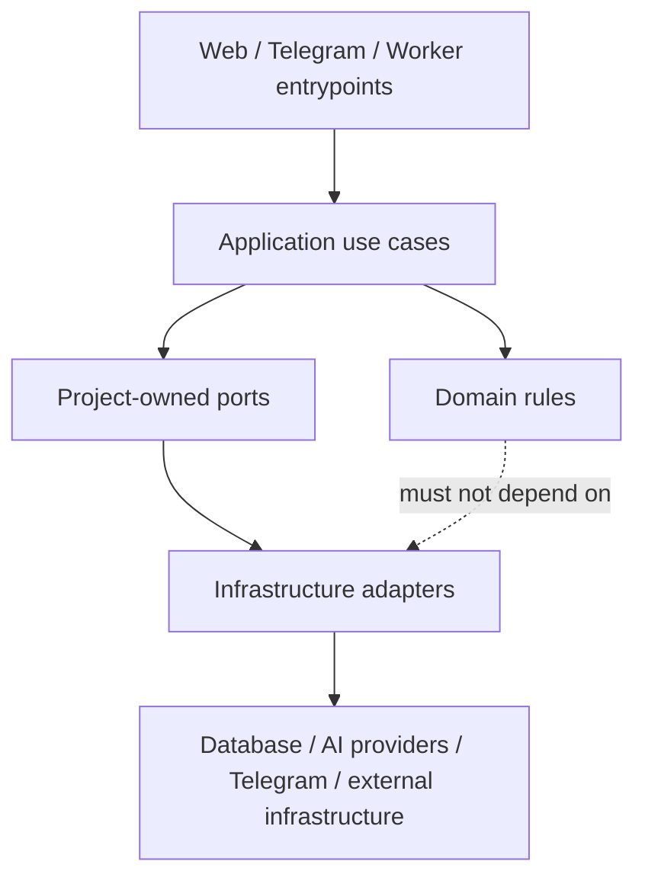

# Architecture Spine — Mahalla Ovozi

## Design Paradigm

Mahalla Ovozi is a **hexagonal modular monolith**: one cohesive application/codebase and MVP deployment boundary, organized into domain-oriented modules. Domain and application logic depend only on project-owned contracts. Web/Telegram transports, persistence, durable jobs, AI providers, and other infrastructure integrate through adapters at meaningful external or stateful boundaries.

HTTP/webhook handling and asynchronous workers may run as separate runtime processes from the same codebase when operationally useful; they are not independently designed microservices.

## Product-Bound Constraints

These approved product semantics constrain architecture and are not implementation choices:

- Topic identity is District + Mahalla + Uzbekistan calendar day + same underlying situation; Topic/reply/topic matching never crosses midnight.
- Context-dependent AI processing uses the complete required raw Accepted Evidence from all same-day Topics in the same Mahalla, plus the supported candidate message when applicable.
- RAG, vector retrieval, summaries, recent-message windows, cross-day memory, or silent truncation must not replace required same-day evidence context.
- Existing completed message-level decisions are not automatically rerun when configuration changes or Topic-derived fields are recalculated.
- AI failures, refusals, invalid structured output, context overflow, timeouts, rate limits, and provider failures remain explicit failures; no partial or invented success may be committed.
- District authorization, lifecycle, retention, subscription rules, and other deterministic policy boundaries are never delegated to AI.

## Invariants & Rules

### AD-1 — Hexagonal modular monolith [ADOPTED]

- **Binds:** all application modules, transports, persistence, jobs, AI integrations, Telegram integrations, and deployment entrypoints.
- **Prevents:** premature microservices, provider SDKs becoming domain contracts, infrastructure concerns leaking into domain rules, and incompatible dependency directions across agent-built modules.
- **Rule:** Build one modular monolith with domain-oriented modules. Domain/application code may depend on project-owned ports but not on infrastructure adapters or provider SDKs. Adapters implement those ports. Separate HTTP/webhook and worker processes may be deployed from the same codebase, but no MVP subsystem becomes an independently versioned network service without a later architecture decision.

## Deferred

The following remain deliberately unbound until their Coaching checkpoints are approved:

- language/runtime and web application stack;
- relational persistence, migration, and durable-job implementation;
- internal module/source-tree seed;
- deterministic same-day evidence snapshot/context serialization contract;
- concurrency, stale-snapshot protection, idempotency, and Topic-derived recalculation mechanics;
- AI gateway/profile/versioning/structured-output contracts;
- authentication, district isolation, secret storage, lifecycle deletion, and audit enforcement;
- deployment topology, backup/restore, disaster recovery, and observability stack.
